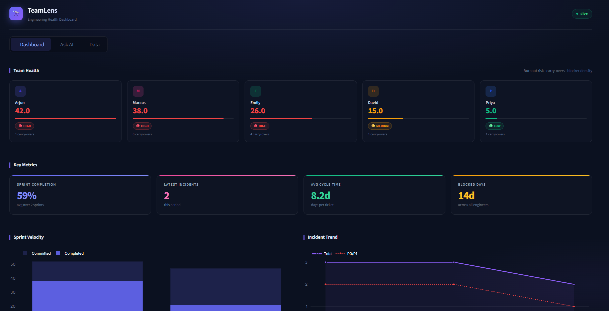
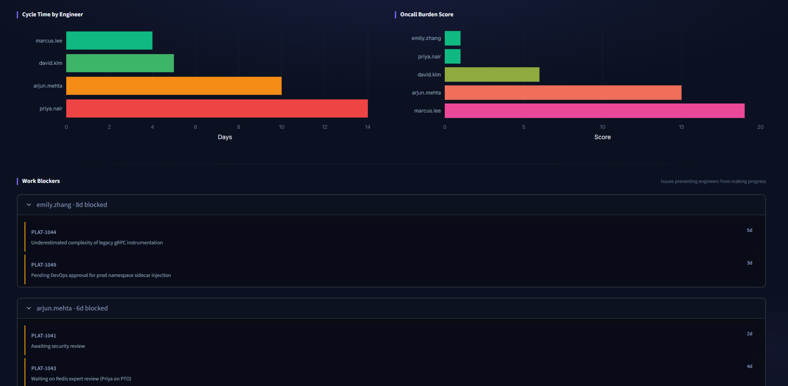
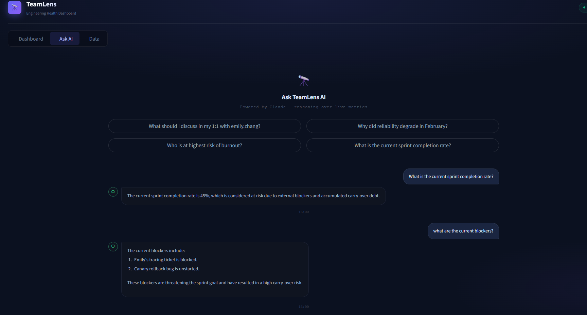
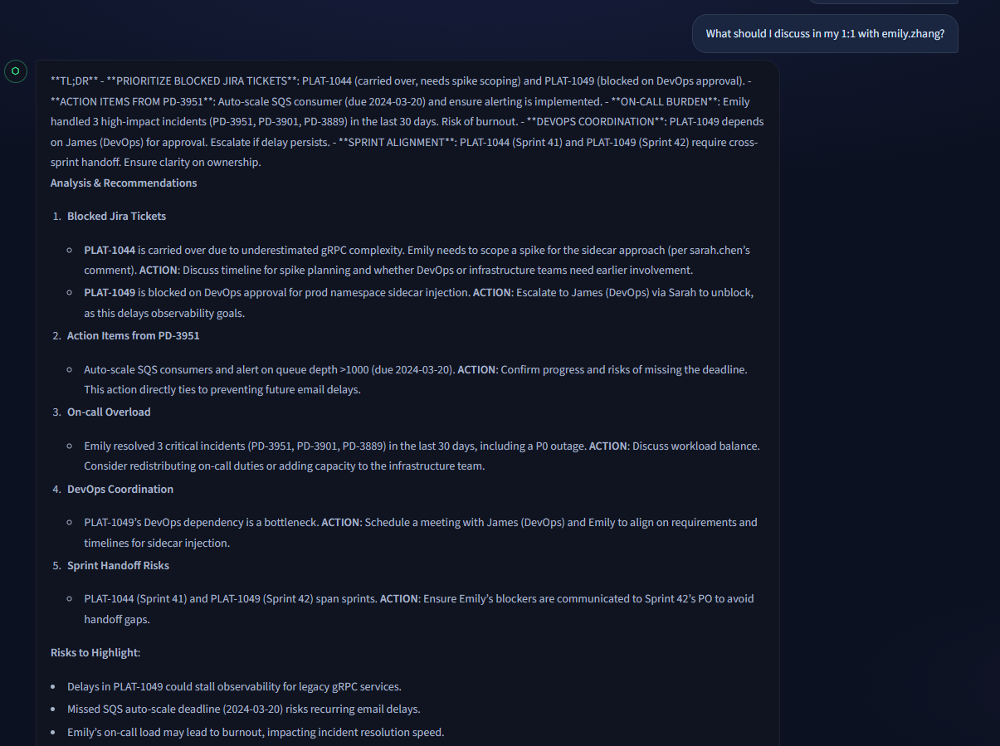

# 🔭 TeamLens

> A conversational AI dashboard for engineering leaders that analyzes repository activity to reveal team health, delivery velocity, and collaboration patterns — turning data your team already generates into decisions you can act on.

---

## What it does

Engineering leaders make decisions about people every day — who to check in with, who is overloaded, what's blocking the team, why reliability is degrading. TeamLens answers these questions using data your team already produces: GitHub pull requests, Jira sprint tickets, and PagerDuty incidents.

Ask it anything in plain English:

- *"Who is at risk of burnout this sprint?"*
- *"What should I discuss in my 1:1 with emily.zhang this week?"*
- *"Why did platform reliability degrade in February?"*
- *"What is the current sprint completion rate?"*

TeamLens retrieves relevant data, reasons across all three sources, and gives you a specific, evidence-backed answer — not a dashboard full of numbers you have to interpret yourself.

---

## Architecture

```
┌─────────────────────────────────────────────────────┐
│                     Streamlit UI                     │
│         Dashboard tab · Chat tab · Data tab          │
└───────────────────────┬─────────────────────────────┘
                        │
                        ▼
┌─────────────────────────────────────────────────────┐
│                   agent.py (Router)                  │
│                                                      │
│   is_reasoning_question()?                           │
│        │                    │                        │
│        ▼                    ▼                        │
│  reasoning_engine.py    ReACT loop                   │
│  (Qwen3-32B via Groq)   (Llama 3.3 70B via Groq)    │
└──────────┬──────────────────┬───────────────────────┘
           │                  │
           ▼                  ▼
┌─────────────────────────────────────────────────────┐
│                  rag_engine.py                       │
│         ChromaDB vector store (local)                │
│   GitHub chunks · Jira chunks · PagerDuty chunks     │
└──────────┬──────────────────────────────────────────┘
           │
           ▼
┌─────────────────────────────────────────────────────┐
│               Data sources                           │
│   GitHub API · Jira (mock) · PagerDuty (mock)        │
└─────────────────────────────────────────────────────┘
```

### How a question flows through the system

1. User asks a question in the chat UI
2. `agent.py` checks if it's a reasoning question ("why", "analyze", "root cause")
3. **Reasoning questions** → `reasoning_engine.py` retrieves context from all three sources, sends to Qwen3-32B with chain-of-thought prompting, returns deep analysis with visible thinking
4. **Simple questions** → ReACT loop sends to Llama 3.3 70B with tool definitions, LLM decides which tools to call, executes them, synthesizes final answer
5. Answer displayed in chat with optional chain-of-thought expander

---

## AI concepts demonstrated

| Concept | Where 
|---|---|
| RAG (Retrieval Augmented Generation) | `rag_engine.py` — ChromaDB vector store 
| Prompt engineering | System prompts in `agent.py` and `reasoning_engine.py` 
| Embeddings | `sentence-transformers` local model 
| Tool calling | `TOOLS` definition + `execute_tool()` in `agent.py` 
| ReACT agent | `while True` loop in `agent.py` 
| Multi-step workflows | Agent calling multiple tools per question 
| Reasoning models | Qwen3-32B via `reasoning_engine.py` 
| Chain-of-thought prompting | `<think>` block extraction in reasoning engine 
| Inference-time scaling | Routing complex questions to a stronger model 
| Data visualization | Plotly charts in Streamlit dashboard

---

## Team health signals

TeamLens tracks six metrics across three data sources:

| Metric | Source | Signal |
|---|---|---|
| Sprint velocity | Jira | Committed vs completed story points per sprint |
| PR cycle time | GitHub | Days from PR opened to merged per engineer |
| Oncall burden | PagerDuty | Weighted score: incidents + 2x after-hours + 3x P0/P1 |
| Blocked work | Jira | Total days blocked per engineer across tickets |
| Incident trend | PagerDuty | Monthly P0/P1/P2 counts — reliability improving or degrading? |
| Burnout risk | All three | Composite score across oncall, blocked days, and carry-overs |

---

## Project structure

```
team-health-dashboard/
├── app.py                  # Streamlit UI — dashboard, chat, data explorer
├── agent.py                # ReACT agent — tool calling + routing logic
├── reasoning_engine.py     # Deep analysis via Qwen3-32B chain-of-thought
├── rag_engine.py           # RAG layer — ChromaDB ingestion and search
├── github_client.py        # GitHub API — PRs, commits, contributors
├── metrics.py              # Computed metrics — velocity, burnout, oncall burden
├── scheduler.py            # Nightly re-ingestion job (optional)
├── mock_data/
│   ├── jira_mock.json      # 2 sprints, 15 tickets, 6 engineers
│   └── pagerduty_mock.json # 8 incidents across 3 months including 1 P0
├── vectorstore/            # ChromaDB persisted data (auto-generated)
├── .env                    # API keys (never commit this)
├── .gitignore
└── README.md
```

---

## Setup

### Prerequisites

- Python 3.9+
- A [Groq](https://console.groq.com) account (free — no credit card needed)
- A GitHub personal access token

### Installation

```bash
# Clone the repo
git clone https://github.com/yourusername/team-health-dashboard
cd team-health-dashboard

# Create and activate virtual environment
python -m venv venv

# Mac/Linux
source venv/bin/activate

# Windows (PowerShell)
venv\Scripts\activate

# Windows (Git Bash)
source venv/Scripts/activate

# Install dependencies
pip install -r requirements.txt
```

### Environment variables

Create a `.env` file in the project root:

```
GITHUB_TOKEN=your_github_personal_access_token
GROQ_API_KEY=your_groq_api_key
```

### First run — ingest data

This populates the ChromaDB vector store. Only needs to run once (or when data changes):

```bash
py rag_engine.py
```

### Start the app

```bash
py -m streamlit run app.py
```

Open [http://localhost:8501](http://localhost:8501)

### Optional — nightly data refresh

Run the scheduler in a separate terminal to automatically re-ingest GitHub data every night at 2 AM:

```bash
py scheduler.py
```

---

## Requirements

Create a `requirements.txt` in your project root:

```
requests
python-dotenv
chromadb
sentence-transformers
groq
streamlit
plotly
schedule
```

Generate it automatically with:

```bash
pip freeze > requirements.txt
```

---


## Screen captures

### Dashboard Views






### AI Assistant View







---
## Example queries

### Simple lookups (Llama 3.3 70B — fast)
```
What is the current sprint completion rate?
Who has the most carry-over tickets?
Which tickets are currently blocked?
Show me the oncall burden across the team
```

### Deep analysis (Qwen3-32B — chain-of-thought)
```
Why did platform reliability degrade in February?
What is the root cause of Emily's carry-over pattern?
Should I be worried about burnout on this team?
Analyze the relationship between oncall burden and sprint velocity
What should I discuss in my 1:1 with arjun.mehta this week?
```

---

## Data sources

| Source | Type | Coverage |
|---|---|---|
| GitHub | Live API | PRs, commits, contributors from any public repo |
| Jira | Mock data | 2 sprints, 15 tickets, 6 engineers, Platform Engineering team |
| PagerDuty | Mock data | 8 incidents Jan–Mar 2024 including 1 P0 full outage |

The mock data is deliberately rich and realistic — it includes blocker reasons, incident postmortems, after-hours flags, carry-over history, and engineer-level commentary. This gives the AI enough signal to produce genuinely useful team health insights.

In a production deployment, Jira and PagerDuty mocks would be replaced with live API integrations.

---

## Future work

- **Live Jira integration** — replace mock data with Jira REST API
- **Live PagerDuty integration** — replace mock data with PagerDuty Events API
- **Slack integration** — surface insights as a daily standup digest
- **Multi-team support** — configure multiple GitHub repos and Jira projects
- **Trend analysis** — track burnout scores week-over-week
- **Alert system** — notify manager when burnout score crosses threshold

---

## Built with

- [Groq](https://groq.com) — LLM inference (Llama 3.3 70B + Qwen3-32B)
- [ChromaDB](https://trychroma.com) — local vector database
- [Sentence Transformers](https://sbert.net) — local embedding model (all-MiniLM-L6-v2)
- [Streamlit](https://streamlit.io) — web UI
- [Plotly](https://plotly.com) — interactive charts
- [GitHub API](https://docs.github.com/en/rest) — live PR and contributor data

---
